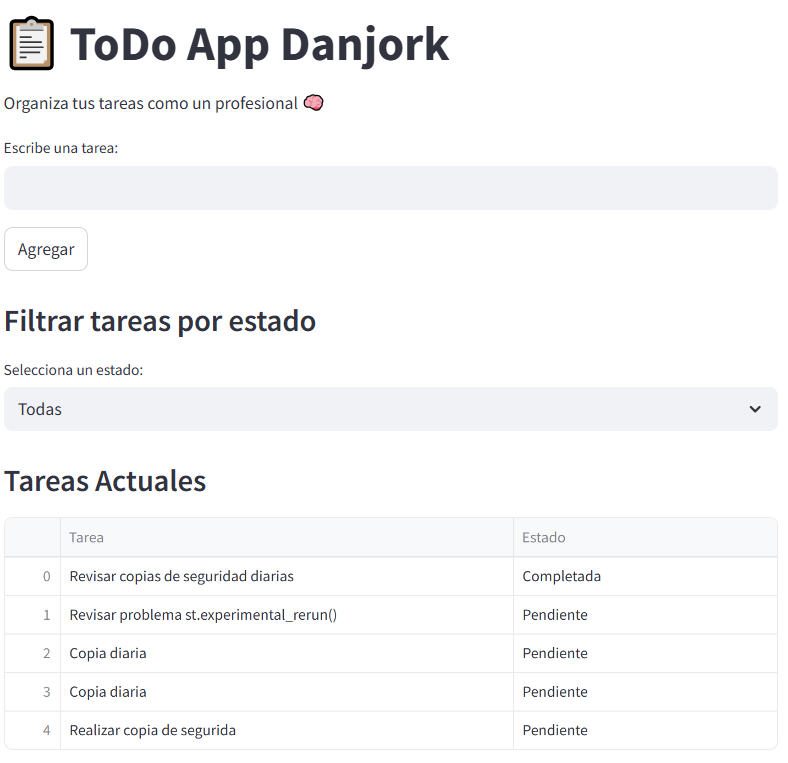

# primer proyecto streamlit
#📝 ToDo App - Danjork
Una pequeña aplicación para gestionar tareas diarias en el trabajo contruida en [StreamLit](https://streamlit.io/) y [Pandas](https://pandas.pydata.org/). Permite crear, visualizar y actualizar tareas como "pendiente", "pausado" o "completado".



## ✨ Funcionalidades

- Agregar nuevas tareas
- Visualizar todas las tareas en una tabla
- Cambiar el estado de una tarea a "Pendiente", "Pausado" o "Completado"
- Almacenamiento archivo CSV

## 🏃 Cómo correr la app

1. **Clona el repositorio**

```bash
git clone https://github.com/tu-usuario/todo-streamlit-app.git
cd todo-streamlit-app

python -m venv .venv
# En Windows:
.venv\Scripts\activate
# En macOS/Linux:
source .venv/bin/activate

pip install -r requirements.txt

streamlit run app.py

#
✅ Requisitos
Python 3.8+

Streamlit

Pandas

# 📝 ToDo App Danjork

Una app sencilla hecha con **Streamlit + Python + pandas** que permite:
- Agregar tareas
- Marcar como completadas o pausadas
- Filtrar por estado
- Eliminar tareas

## 🚀 Ejecutar localmente

```bash
git clone https://github.com/tu_usuario/todo_app_streamlit
cd todo_app_streamlit
pip install -r requirements.txt
streamlit run app.py
